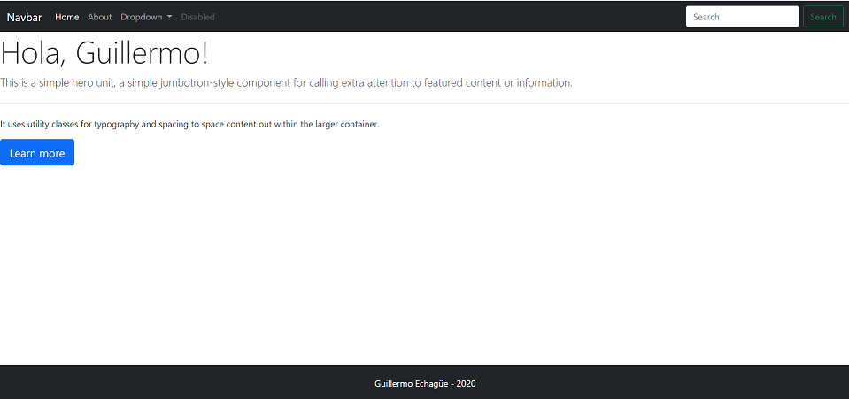
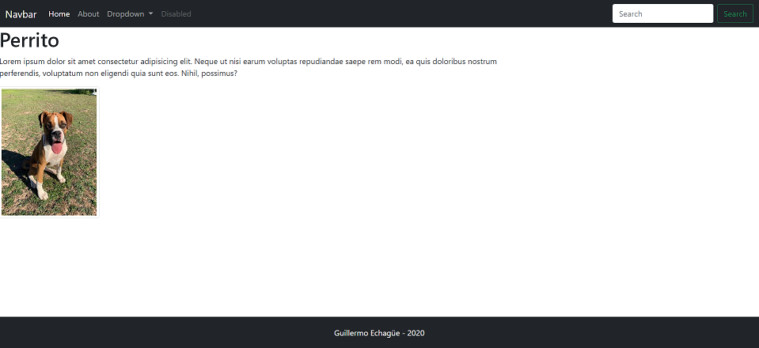

# Proyecto con NODE.js

Desarrollo de una web de prueba con node.js

### Imagenes de la aplicación






## Inicio proyecto en Node.js

```
npm init -y
```

crear app.js


## Instalar Express

```
pm i express --save
```

## Creae HTML
``` 
(!+Tab) con snipper
``` 

## Middleware
``` 
app.use(express.static(__dirname + '/public'));
``` 

## Boostrap

``` 
getbootstrap.com

dist/
``` 

## Handlebars

```
npm install hbs --save
```

## Correr servidor server

```
nodemon server -e js,hbs,html,css
```

## Cargar en Github Pages
```
npm i -D gh-pages
```